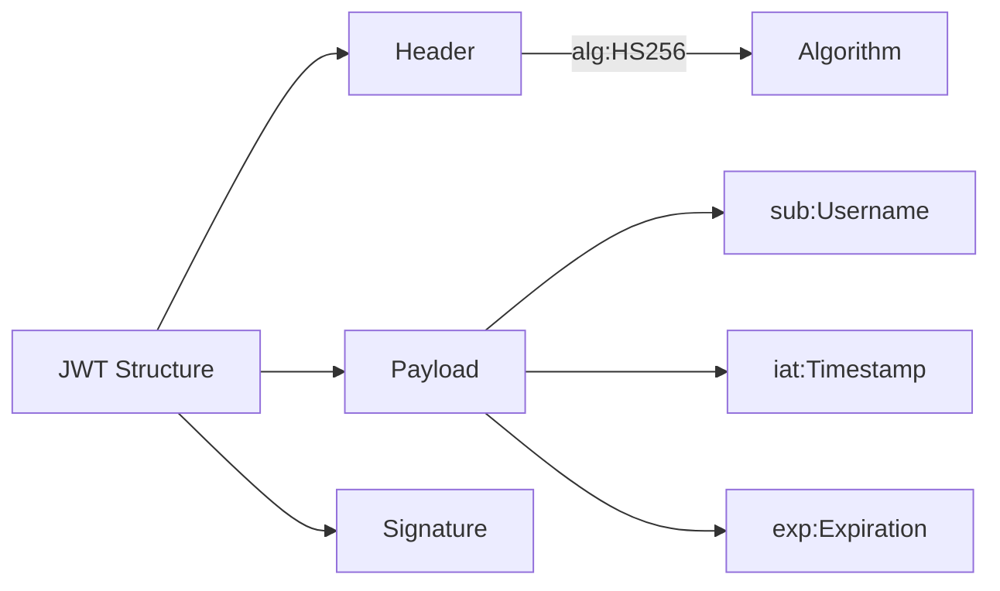
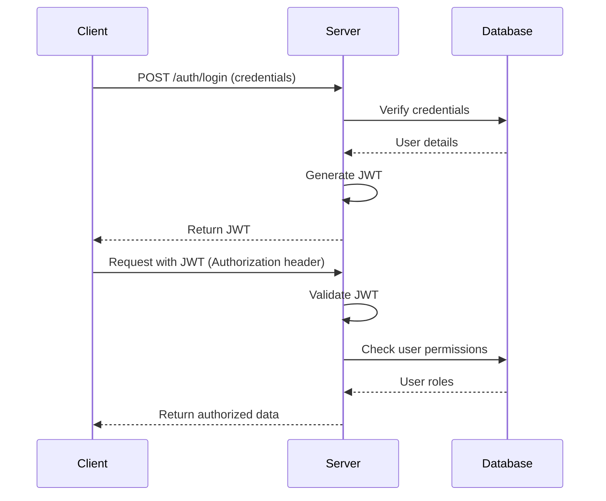

# Spring Security with JWT Authentication 🔐


[](https://opensource.org/licenses/MIT)

A secure REST API implementation using Spring Security with JSON Web Token (JWT) authentication. This project demonstrates modern security best practices for protecting Spring Boot applications.

---

## 📌 Features

- **JWT-based authentication** (Access Token)
- Role-based authorization (`USER`, `ADMIN`)
- Secure password storage with BCrypt
- Custom security filters
- Exception handling for security scenarios
- Ready-to-use authentication endpoints

---

## 🛠️ Tech Stack

- **Java 17+**
- **Spring Boot 3.1+**
- Spring Security
- JJWT (Java JWT Library)
- Lombok
- H2 Database (for demonstration)

---

## 🍵 JWT Structure


---

## 🔐 Security Flow


---

## 🚀 Getting Started

**Prerequisites**
- Java 17+
- Maven 3.8+
- Your favorite IDE

**Installation**

Clone the repository:

```bash
    git clone https://github.com/kawindu2002/Spring-Security.git
```

**Navigate to project directory:**

```bash
   cd Spring-Security
```

**Configuration**

1.Set your JWT secret in application.properties:

```properties
    jwt.secretKey=your-256-bit-secret-change-this-for-production
    jwt.expiration=86400000 # 24 hours in milliseconds
```

**Running the Application**

```bash
    mvn spring-boot:run
```
---

## 📡 API Endpoints


| Method     | Endpoint       | Description                    | Access             |
|------------|----------------|--------------------------------|--------------------|
| POST       | /auth/register | Register new user              | Public             |
| POST       | /auth/login    | Authenticate and get JWT token | Public             |
| GET        | /hello/user    | User greeting                  | ROLE_USER          |
| GET        | /hello/admin   | Admin greeting                 | ROLE_ADMIN         |

---

## 🔧 Testing with Postman

**Register a new user:**

```
    POST http://localhost:8080/auth/register
    Content-Type: application/json
    
    {
    "username": "testuser",
    "password": "password123",
    "role": "USER"
    }
```

**Login to get JWT:**

```
POST http://localhost:8080/auth/login
Content-Type: application/json

{
"username": "testuser",
"password": "password123"
}
```
**Access protected endpoint:**

```
GET http://localhost:8080/hello/user
Authorization: Bearer <your-jwt-token>
```
---

## 📬 Contact

**Developer:** Kawindu Priyashan  
**GitHub:** [Kawindu Priyashan](https://github.com/kawindu2002)  
**Email:** kawindupriyashan@gmail.com 
