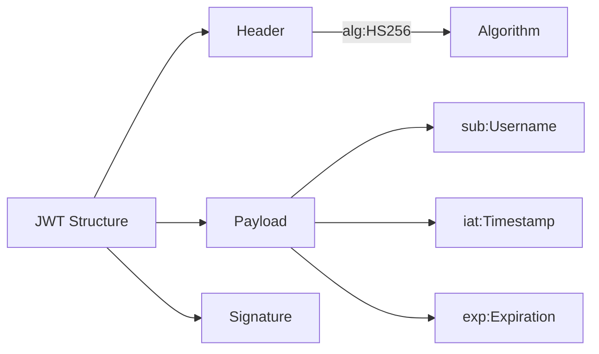
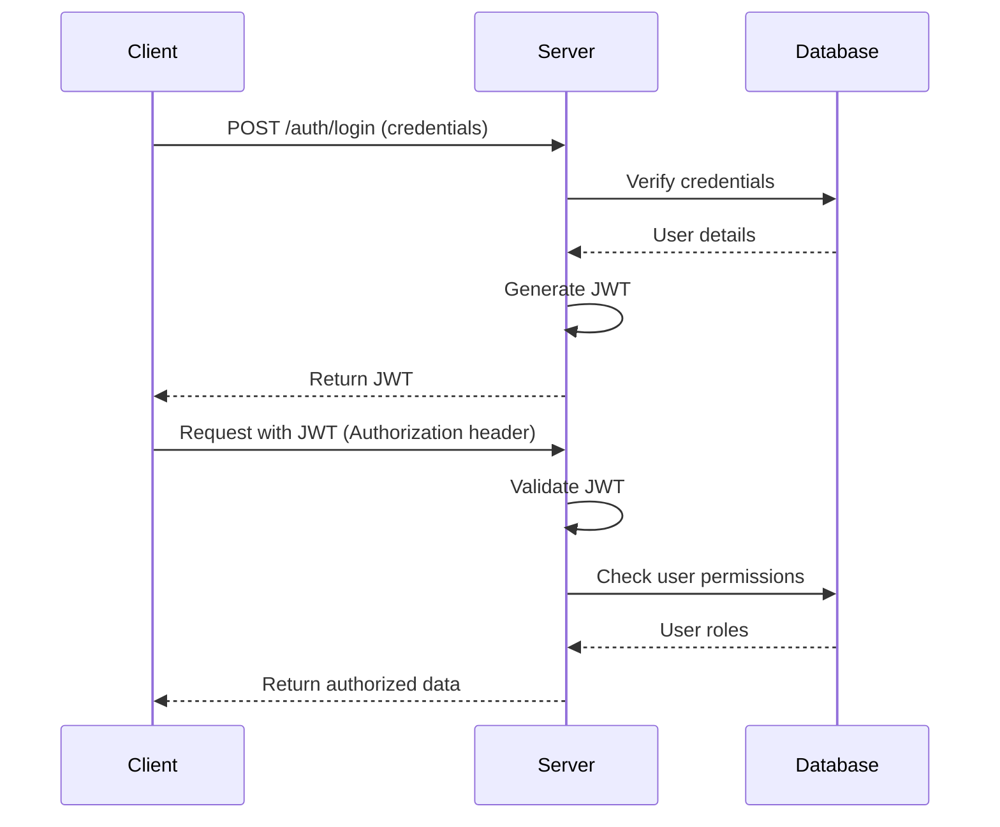

# Spring Security with JWT Authentication 🔐

A secure REST API implementation using Spring Security with JSON Web Token (JWT) authentication. This project demonstrates modern security best practices for protecting Spring Boot applications.

## 📌 Features

- **JWT-based authentication** (Access Token)
- Role-based authorization (`USER`, `ADMIN`)
- Secure password storage with BCrypt
- Custom security filters
- Exception handling for security scenarios
- Ready-to-use authentication endpoints

## 🛠️ Tech Stack

- **Java 17+**
- **Spring Boot 3.1+**
- Spring Security
- JJWT (Java JWT Library)
- Lombok
- H2 Database (for demonstration)

## 🍵 JWT Structure

## 🔐 Security Flow

