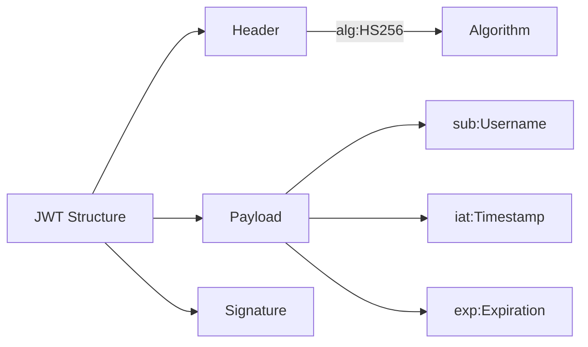

# Spring-Security

```mermaid
graph LR
    A[JWT Structure] --> B[Header]
    A --> C[Payload]
    A --> D[Signature]
    B -->|alg:HS256| E[Algorithm]
    C --> F[sub:Username]
    C --> G[iat:Timestamp]
    C --> H[exp:Expiration]
```
